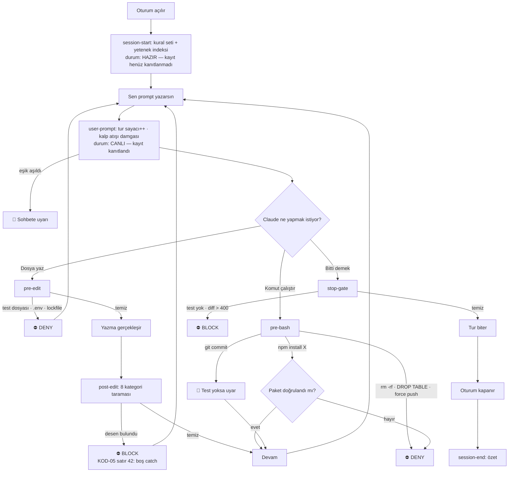

# LenaRise.SlopGuard — Agentic Kalite Koruma Plugin'i

## Context

Bu oturum "AI slop" olgusunun 8 kategoride kaynaklı bir teşhis listesiyle başladı (rapor `scratchpad/ai-slop-rehberi.html` içinde hazır, yayınlanmadı). Kullanıcı sonra asıl soruna geçti: **teşhisi listelemek yetmez, üretimi mekanik olarak engellemek gerekir.**

Amaç: agentic geliştirme sırasında üretilen çıktının güvenilir ve kaliteli olmasını sağlamak — tüm projelerde, Claude Code'da ve mümkün olduğunca diğer AI agent'larında.

**Kullanıcı tercihleri (onaylandı):**
- Tek **plugin** olarak paketlensin, adı **LenaRise.SlopGuard**
- **Sert mod**: slop deseni bulunduğunda dursun
- **Sekiz kategorinin tamamı** hem kural setinde hem mekanizmada karşılık bulsun
- **GitHub'dan tek cümleyle kurulsun**, klonlama gerektirmesin
- **İnsan tarafı hataları sohbette uyarı** olarak gelsin
- **Kurulum sonrası düzenlenebilir kalsın** — ekleme, çıkarma, eşik değiştirme
- **README hem kullanıcının hem AI'ın anlayacağı bir yetenek referansı olsun**; AI değişiklikleri önerebilmeli veya kullanıcı adına yapabilmeli

### İsimlendirme

| | Değer |
|---|---|
| Görünen ad | **LenaRise.SlopGuard** |
| Plugin tanımlayıcısı | `lenarise-slopguard` (nokta içermeyen güvenli slug; `claude plugin validate` ile teyit edilecek) |
| Yapılandırma dizini | `~/.claude/lenarise-slopguard/` |
| Komut öneki | `/slop-*` (kısa, yazması kolay) |

### Mevcut kurulumun tespiti

| Bulgu | Sonucu |
|---|---|
| `~/.claude/CLAUDE.md` **yok** | Hiç kişisel kural seti yok |
| `permissions` bloğu **yok** | Mekanik yasak yok |
| Tüm event'lerde `pixel-agents` hook'u kayıtlı | Kurulum bunu ezmemeli — CLI kendi birleştirmesini yapar, yine de yedeklenip teyit edilir |
| `skipDangerousModePermissionPrompt: true` | Bypass modu kullanımda → `permissions.deny` güvenilmez, koruma **hook katmanında** olmalı |

### Tasarımın dayandığı ilke

Replit vakası: talimat büyük harfle, tekrar tekrar verilmişti ve ihlal edildi. Kural metni *niyeti* taşır, hook *sınırı* koyar.

| Katman | Model atlayabilir mi? | Kapsadığı agent'lar |
|---|---|---|
| Kural metni | Evet — bağlam çürümesi (AGT-01) | Claude Code |
| Skill | Evet | Claude Code |
| **Hook** | **Hayır** — harness çalıştırır | Claude Code |
| **Git hook + CI** | **Hayır** | **Hepsi** |

---

## Üç katman, üç hedef kitle

1. **Makine katmanı (hook)** — modelin atlayamayacağı sınırlar
2. **İnsan katmanı (koç)** — `systemMessage` ile *sana* gelen uyarılar
3. **Repo katmanı (git + CI)** — hangi agent yazarsa yazsın

---

## Katman 1 — Makine: kategori → mekanizma

| Kategori | Zorlama | Nasıl |
|---|---|---|
| **KOD** kod kalitesi | ✅ Güçlü | Boş `catch`, Guard-and-Go, `_v2` dosya, diff içi duplikasyon |
| **MTK** doğruluk | ⚠️ Kısmî | Paket kurulumunu yakala → doğrulama zorunlu. İş mantığı yalnızca kural |
| **TST** test | ✅ **En güçlü** | Test dosyası yazımını engelle — ImpossibleBench: test görünmezse hile ~0 |
| **GUV** güvenlik | ✅ Güçlü | Secret regex, SQL concat, `eval(`, paket doğrulama |
| **AGT** agent op. | ✅ Güçlü | Yıkıcı bash, prod işaretçileri |
| **SUR** süreç | ✅ Orta | Stop kapısı: diff boyutu, test çalıştırıldı mı, temelsiz süre tahmini |
| **DOK** kod dışı | ✅ Orta | Emoji başlık, buzzword, boş commit mesajı |
| **INS** insan | → Katman 2 | Oturum ölçümü + sohbet uyarısı |

### Hook davranışı (sert mod)

| Hook | Olay | Davranış |
|---|---|---|
| `pre-edit` | PreToolUse `Edit\|Write` | Test dosyası / korumalı yol (`.env`, lockfile, CI config) → `permissionDecision: "deny"` |
| `post-edit` | PostToolUse `Edit\|Write` | Desen bulunursa `decision: "block"` + kategori/satır — düzeltmeden ilerleyemez |
| `pre-bash` | PreToolUse `Bash` | Yıkıcı komut → `deny`. Paket kurulumu doğrulanmadıysa → `deny` |
| `stop-gate` | Stop | Değişiklik var ama test yoksa, ya da diff eşiği aşıldıysa → `block` |
| `session-start` | SessionStart | Kural seti **+ yetenek indeksi** enjekte eder |

---

## Katman 2 — İnsan koçu: sohbete gelen uyarılar

Hook'lar `systemMessage` ile **kullanıcıya** mesaj gösterebilir. Oturum durumu `~/.claude/lenarise-slopguard/session-<id>.json` içinde tutulur. Her uyarı bir oturumda **bir kez** çıkar.

| Sinyal | Ölçüm | Eşik | Sohbete çıkan uyarı |
|---|---|---|---|
| Bağlam çürümesi | Tur sayacı | 40 tur | "Bu oturum uzadı — yeni göreve yeni oturumla başla (AGT-01)" |
| Kavrayış borcu | Yazılan − okunan satır | 500 fark | "800 satır üretildi, incelenen 60. Merge öncesi oku (INS-01)" |
| Commit'siz ilerleme | Son commit'ten beri değişen satır | 300 satır | "Geri dönebileceğin nokta kalmadı (AGT-06)" |
| Zincirleme düzeltme | Aynı dosyaya ardışık düzeltme | 3 tur | "Aynı yere üçüncü yama. Yaklaşımı değiştir (MTK-05)" |
| Doğrulanmamış commit | `git commit` öncesi | her seferinde | "Bu turda test çalıştırılmadı. Yine de commit? (TST-05)" |
| Oturum özeti | SessionEnd | her oturum | "N satır · M test · K commit · J engellenen slop" |

Son satır kasıtlı: METR'e göre verimlilik algısı 39 puan sapıyor. Oturum sonu sayacı öz-beyan yerine **ölçüm** koyar.

Bu katman sert modda bile **bloklamaz** — uyarır. İnsan kararı bloklanacak bir şey değil.

---

## Katman 3 — Repo kiti (agent-agnostic)

`/slop-repo-init` ile hedef repoya kurulur: **`AGENTS.md`** (Cursor/Codex/Copilot/Claude Code ortak kural dosyası) · **`pre-commit`** (git düzeyinde, hangi agent yazarsa yazsın) · **`semgrep-slop.yml`** · **CI workflow** (jscpd, gitleaks, semgrep, coverage tabanı).

Claude Code hook'ları yalnızca Claude Code'u kapsar; git hook'u herkesi.

---

## Kurulum — klonlama yok, `curl | bash` yok

`claude plugin` CLI doğrulandı: `marketplace add` bir GitHub repo'sunu doğrudan kabul ediyor.

```bash
claude plugin marketplace add <owner>/LenaRise.SlopGuard
claude plugin install lenarise-slopguard@lenarise-slopguard -y
```

Kullanıcı açısından tek cümle yeter: Claude'a repo adresini verip **"bunu kur"**. Claude iki komutu çalıştırır, `claude plugin validate` ile doğrular, `/slop-setup` ile yapılandırmayı iskeletler ve hook'ları boru testinden geçirir.

**`curl | bash` neden tercih edilmedi:** indirmeyi ortadan kaldırmıyor, gizliyor (hook'lar `${CLAUDE_PLUGIN_ROOT}` yollarını çalıştırdığı için dosyalar diske inmek zorunda) · Claude Code'un sürüm/güncelleme/doğrulama yönetimi devre dışı kalır · incelenmemiş uzak kodu kabuğa boru etmek bu plugin'in engellemek için var olduğu davranış (GUV). Slop bekçisini slop üreterek kurmak tutarsız olur.

| İş | Komut |
|---|---|
| Güncelle | `claude plugin update lenarise-slopguard` |
| Geçici kapat | `claude plugin disable lenarise-slopguard` — yapılandırma korunur |
| Kaldır | `claude plugin uninstall lenarise-slopguard` + `marketplace remove` |

---

## Özelleştirme — güncelleme asla ezmez

| | Nerede | Kim yazar | Güncellemede |
|---|---|---|---|
| **Mekanizma** | Plugin cache'i | Plugin | Değişir — **elle düzenlenmez** |
| **Yapılandırma** | `~/.claude/lenarise-slopguard/` | Sen | **Asla ezilmez** |

```
~/.claude/lenarise-slopguard/
├── rules.local.md           # senin "bunu yap / bunu yapma" kuralların
├── config.json              # kip, eşikler, kapatılan desenler, güvenilen paketler
├── patterns.local.json      # senin eklediğin desenler
└── session-<id>.json        # oturum durumu (otomatik, dokunma)

<her repo>/.slopignore       # proje bazlı yol muafiyeti
```

Birleştirme sırası: plugin varsayılanları → `config.json` → `patterns.local.json` → repo `.slopignore` → oturum kipi.

---

## Görünürlük — kullanıcı ayarlı

Claude Code hook'ları yalnızca hata verirse ya da yavaşsa görünür; **başarılı çalışma sessizdir.** Bu yüzden görünürlük kozmetik değil, doğruluğun parçası: koruma olmaması kadar tehlikeli olan, koruma olduğunu sanmak (INS-04 aşırı güven).

Görünürlük seviyeleri `config.json` → `ui` altında, `/slop-config` ile sohbetten değiştirilebilir.

### Durum çubuğu — üç kip

`statusLine` `settings.json`'da tanımlanır (ayarın şu an **boş**, çakışma riski yok). `/slop-setup` kurar, `/slop-config` değiştirir; girdiye bir işaret konur ki kaldırırken yalnızca bizimki silinsin.

| Kip | Görünen | Kime |
|---|---|---|
| `compact` | `SlopGuard canlı · sert · 3 engellendi · tur 12/40 · +420/-80 · test 4dk` | Ayrıntı takip edenler |
| `minimal` | `SlopGuard canlı · 3` | Sadece canlılık + sayaç isteyenler |
| `off` | — | Tool çağrılarından takip edenler |

### Durum çubuğu asla yalan söylemez

Kalp atışını yalnızca oturum başında yazmak **yetersiz**: hook'lar oturum ortasında bozulursa damga hâlâ taze görünür ve çubuk canlı olmadığı hâlde "canlı" der. Bu tam olarak engellemeye çalıştığımız şey — doğrulanmamış başarı beyanı (TST-05).

`canlı` demek için **iki ayrı kanıt** gerekir; ikisi farklı şeyi kanıtlar:

| Kanıt | Neyi kanıtlar | Nasıl |
|---|---|---|
| **Kayıt** | Claude Code hook'u tanıyor ve tetikliyor | `user-prompt.mjs` bu oturumun `sessionId`'siyle damga yazdı mı — her kullanıcı mesajında tetiklendiği için en erken ve en sık kanıt |
| **Çalışabilirlik** | Script şu an doğru cevap veriyor | `statusline.mjs` her yenilemede `post-edit.mjs`'e sentetik yük gönderir, beklenen çıktıyı doğrular |

Script kusursuz çalışıyor olabilir ama kayıtlı olmayabilir; ya da kayıtlı olup `node` yolu bozulmuş olabilir. Tek kanıt yeterli değil.

**Gösterilen durumlar — kanıtlanana kadar "canlı" yok:**

| Durum | Anlamı |
|---|---|
| `SlopGuard hazır` | Kurulu, script cevap veriyor, ama bu oturumda **henüz tetiklenmedi** — kayıt kanıtlanmadı |
| `SlopGuard canlı · …` | Bu oturumda tetiklendi **ve** probe geçti — iki kanıt da var |
| `SlopGuard ⚠️ kayıtsız` | Kullanıcı mesaj attı ama hook tetiklenmedi → Claude Code hook'u tanımıyor |
| `SlopGuard ⚠️ bozuk` | Script probe'a cevap vermiyor → `node`, izin veya dosya sorunu |
| `SlopGuard kapalı` | Kullanıcı bilerek devre dışı bıraktı |

`hazır` ile `canlı` ayrımı kasıtlı: ilk mesajdan önce kayıt kanıtlanamaz, o yüzden iddia edilmez. Belirsizliği "canlı" diye yuvarlamak, çubuğu işe yaramaz kılar.

**Doğrulanacak varsayım:** `statusLine` komutunun stdin'de `session_id` alıp almadığı. Almıyorsa kayıt kanıtı `heartbeat.json`'daki artan sayaç ile kurulur (sayaç ilerlemiyorsa hook tetiklenmiyordur). Hangi yolun geçerli olduğu koda geçmeden önce fiilen sınanacak — tahminle inşa edilmeyecek.

### Temiz taramalar — iki kip

| Kip | Davranış |
|---|---|
| `silent` | Temiz kod sessizce geçer; yalnızca blok ve uyarı görünür |
| `summary` | Her tur sonunda tek satır: `4 dosya tarandı · temiz` |

### `config.json` → `ui` şeması

```json
{
  "ui": {
    "statusLine": "compact",     // compact | minimal | off
    "cleanScans": "silent",      // silent | summary
    "heartbeat": true,           // oturum başı tek satır onay
    "livenessCheck": "ask"       // ask | warn | off
  }
}
```

---

## Sessiz ölüm koruması

**Mantıksal tuzak:** hook'lar kayıtlı değilse hiçbir hook çalışmaz — "çalışıyor musun?" diye soracak hook dahil. Yokluk, yok olan şeye sordurularak tespit edilemez. Tespit **plugin'in dışından** gelmeli.

### Kalp atışı damgası — temel primitif

Plugin her tetiklenmede `~/.claude/lenarise-slopguard/heartbeat.json` dosyasına yazar:

```json
{ "ts": 1757000000, "version": "1.0.0", "patterns": 47, "mode": "strict", "sessionId": "..." }
```

Böylece "canlı mı?" sorusu bir **dosya kontrolüne** dönüşür — cevaplamak için plugin'in canlı olması gerekmez. Üç bağımsız tüketici okur:

| Tüketici | Plugin'den bağımsız mı | Ne yapar |
|---|---|---|
| **statusLine script'i** | ✅ `settings.json`'da yaşar | Damga bayatsa `🛡 ⚠️ YANIT YOK` gösterir |
| **`~/.claude/CLAUDE.md` kuralı** | ✅ Claude Code yükler | statusLine kapalıysa yedek: model kalp atışını görmezse kullanıcıya sorar |
| **`/slop-doctor`** | ⚠️ Plugin komutu | Talep üzerine tam teşhis (plugin yüklüyse çalışır) |

`CLAUDE.md` kuralının zayıf katman olması sorun değil: burada bir şeyi *zorlamıyor*, güçlü katmanın yokluğunu *tespit ediyor*. Ve zayıf katman, güçlü katmanın yokluğunu tespit edebilen tek katman.

### Yanıt vermediğinde ne olur

`livenessCheck: "ask"` (varsayılan) — sohbette sorulur, sessizce devam edilmez:

```
⚠️  LenaRise.SlopGuard yanıt vermiyor (son kalp atışı: 3 gün önce).
    Bu oturum şu an korumasız çalışıyor.

    1) /slop-doctor ile teşhis et ve düzelt
    2) Bu oturumu korumasız sürdür
```

Kullanıcı 2'yi seçerse karar oturum durumuna yazılır ve **aynı oturumda bir daha sorulmaz** — tekrar eden uyarı görmezden gelinir, bu da bir slop biçimi. `warn` kipi sorar ama beklemez; `off` hiç sormaz.

### `/slop-doctor` — talep üzerine teşhis

Kontrol eder ve her satır için ✅/❌ basar: plugin kurulu ve etkin mi · `hooks.json` geçerli mi · her hook boru testine cevap veriyor mu · `config.json` ve `patterns.local.json` geçerli JSON mu · kaç desen yüklendi (beklenenle karşılaştırır) · `node` erişilebilir mi · statusLine kayıtlı mı · **hook'lar bypass permissions modunda çalışıyor mu** · kalp atışı ne kadar taze. Düzeltilebilir bir sorun bulursa düzeltmeyi önerir.

---

## README — çift hedefli yetenek referansı

Kullanıcının şartı: *"AI, LenaRise.SlopGuard'ın yeteneklerini anlayabilmeli; değişikliği önerebilmeli veya kullanıcı yerine yapabilmeli."*

### Keşif üç katmanlı olacak

Tam README'yi her oturumda bağlama yüklemek AGT-02'nin (aşırı bağlam) kendisi olur. Bunun yerine:

| Katman | İçerik | Ne zaman yüklenir | Boyut |
|---|---|---|---|
| **Yetenek indeksi** | Hangi levyeler var, hangi dosyada | `session-start` ile her oturumda | ~15 satır |
| **`/slop-config` skill'i** | Tam şema + niyet eşlemesi + güvenlik kuralları | Kullanıcı değişiklik isteyince | Tam |
| **`README.md`** | Kanonik kaynak, insan + AI | Elle okunduğunda | Tam |

Üçü de `lib/patterns.mjs` ve `templates/config.default.json`'dan **üretilir** (`npm run docs`). Elle senkron tutulmaz — doküman-kod ayrışması (DOK-07) bu projenin kendi kategorilerinden biri, kendi kuralına uyacak.

### README yapısı

```
# LenaRise.SlopGuard
## Ne yapar · Kurulum · Oturumda ne olur (akış şeması)
## Yapılandırma referansı            ← kanonik, makine-okunur
   · Yetenek matrisi   (ne değiştirilebilir → dosya → alan → örnek değer)
   · Dosya şemaları    (config.json ve patterns.local.json tam şema + örnek)
   · Desen kataloğu    (her ID → ne yakalar → varsayılan durum → kapatılabilir mi)
   · Komut referansı
## AI için: kullanıcıya nasıl yardım edersin
   · Niyet → eylem eşleme tablosu
   · Güvenli / güvensiz düzenlemeler
   · Düzenleme sonrası doğrulama adımları
## Sorun giderme · Kaldırma
```

Başlıklarda emoji yok — DOK-04 kendi kuralımız; kendi README'mizin ihlal etmesi tutarsız olurdu.

### "AI için" bölümü — niyet → eylem eşlemesi

Bu tablo README'ye aynen girecek; herhangi bir oturumdaki AI bunu okuyup işlemi yapabilir.

| Kullanıcı ne der | Ne anlama gelir | AI ne yapar |
|---|---|---|
| "bu uyarı sürekli çıkıyor" | desen gürültülü | `config.json` → `disabled` listesine desen ID'si ekle |
| "çok fazla blokluyor" | sert mod ağır geliyor | Önce hangi ID'ler tetikleniyor göster, sonra hedefli kapat — tümünü gevşetme |
| "prototip yapıyorum" | geçici gevşetme | `/slop-mode explore` — kalıcı config'e dokunma |
| "test dosyalarına yazabilmeli" | TST kilidi engel | `config.json` → `allowTestWrites: true` (gerekçesini sor ve kaydet) |
| "şu paketi hep engelliyor" | paket doğrulama takıldı | `config.json` → `trustedPackages` listesine ekle |
| "diff sınırı küçük" | eşik dar | `config.json` → `thresholds.maxDiffLines` |
| "şunu da yakalasın" | yeni desen | `patterns.local.json`'a ekle, **önce boru testiyle dene** |
| "kendi kuralımı ekle" | kişisel kural | `rules.local.md`'ye ekle, kısa tut |
| "bu repoda hiç çalışmasın" | proje muafiyeti | Repo kökünde `.slopignore` |
| "ne durumdayım" | görünürlük | `/slop-status` |

**AI için güvenlik kuralları** (README'de açık madde olarak):
- Plugin cache'ini **asla** düzenleme — güncelleme siler; düzenleme yalnızca `~/.claude/lenarise-slopguard/` içine
- Düzenlemeden önce ilgili dosyayı yedekle, sonra `jq -e` ile JSON'u doğrula
- Bir deseni kapatırken **neyi kaybettiğini** kullanıcıya söyle (örn. "GUV-03'ü kapatırsan gömülü sırlar artık yakalanmaz")
- Güvenlik kategorisini (GUV) kapatma önerisini kendiliğinden yapma — kullanıcı açıkça isterse yap ve riski yaz
- Değişiklik sonrası yeniden başlatma gerekip gerekmediğini söyle (config değişiklikleri anında, hook/manifest değişiklikleri restart ister)

---

## Repo yapısı

**Geliştirme konumu:** onay anında belirlenecek. Dağıtım GitHub üzerinden olduğu için kurulumda yerel yola bağımlılık yok.

```
LenaRise.SlopGuard/
├── README.md                       # ← çift hedefli yetenek referansı (üretilir)
├── CLAUDE.md                       # repo'da çalışan agent'a: kendi kurallarına uy
├── package.json                    # docs üretimi + testler
├── .claude-plugin/
│   ├── plugin.json                 # name: lenarise-slopguard
│   └── marketplace.json
├── hooks/
│   ├── hooks.json
│   ├── session-start.mjs           # kural seti + yetenek indeksi
│   ├── user-prompt.mjs             # tur sayacı → koç uyarıları
│   ├── pre-edit.mjs                # test/korumalı yol savunması
│   ├── post-edit.mjs               # 8 kategori taraması → BLOCK
│   ├── pre-bash.mjs                # yıkıcı komut + paket doğrulama
│   ├── stop-gate.mjs               # doğrulama kapısı → BLOCK
│   └── session-end.mjs             # oturum özeti
├── bin/
│   └── statusline.mjs              # settings.json'dan çağrılır; heartbeat'i okur,
│                                   # plugin ölse bile çalışır → ⚠️ YANIT YOK
├── lib/
│   ├── patterns.mjs                # desen defteri — TEK KAYNAK
│   ├── heartbeat.mjs               # damga yaz/oku — canlılık primitifi
│   ├── session.mjs · coach.mjs · config.mjs · report.mjs
├── rules/base-rules.md             # paket kural seti (~50 satır, 8 kategori)
├── scripts/gen-docs.mjs            # patterns.mjs → README bölümleri + yetenek indeksi
├── skills/
│   ├── slop-config/SKILL.md        # tam yapılandırma referansı (AI için)
│   ├── slop-check/SKILL.md
│   └── slop-repo-init/SKILL.md
├── commands/
│   ├── slop-setup.md · slop-config.md · slop-check.md · slop-doctor.md
│   ├── slop-repo-init.md · slop-mode.md · slop-status.md
└── templates/
    ├── config.default.json · patterns.local.example.json · rules.local.md
    ├── claude-md-snippet.md        # ~/.claude/CLAUDE.md'ye eklenecek canlılık kuralı
    ├── AGENTS.md · pre-commit · semgrep-slop.yml · github-workflow-slop-gate.yml
```

`/slop-setup` şablonlardan yapılandırma dosyalarını **yalnızca yoksa** oluşturur; var olanlara dokunmaz — her güncellemeden sonra güvenle tekrar çalıştırılır.

---

## Oturum içi kullanım akışı



**Elle çağırdıkların:** `/slop-check` · `/slop-status` · `/slop-doctor` · `/slop-config` · `/slop-mode explore|strict` · `/slop-repo-init` · `/slop-setup`

**Kurulum akışı:** Claude'a repo adresi + *"bunu kur"* → `marketplace add` → `install -y` → `validate` → `/slop-setup` → yeniden başlat.

---

## Desen defteri (`lib/patterns.mjs`)

Tek kaynak; hook'lar, `/slop-check`, semgrep şablonu ve README buradan türer.

- **KOD** — `catch\s*\([^)]*\)\s*\{\s*\}` · `except[^:]*:\s*pass` · `.catch(() => {})` · yeni `if (false)`/`if (0)` sarmalama · `*_v2.*` `*_new.*` `*_old.*` · diff içi ≥8 satır tekrar
- **MTK** — `npm i|install`, `pip install`, `yarn add`, `bun add` → doğrulanmadıysa engelle
- **TST** — `**/*.test.*` `**/*.spec.*` `**/test_*.py` `**/tests/**` · `assert True` · `expect(true).toBe(true)` · `it.skip` `xit(` `@pytest.mark.skip` · `throw new Error("Not implemented")` · tek satırlık `return true;` gövdesi
- **GUV** — `(api[_-]?key|secret|token|password)\s*[:=]\s*["'][A-Za-z0-9_\-]{16,}` · `AKIA[0-9A-Z]{16}` · `-----BEGIN .*PRIVATE KEY-----` · SQL birleştirme / f-string SQL · `eval(` · değişkenli `exec(`
- **AGT** — `rm -rf` · `DROP TABLE` · `TRUNCATE` · `WHERE`'siz `DELETE FROM` · `git push --force` · `git reset --hard` · `chmod 777` · yıkıcı fiil + `prod|production`
- **SUR** — Stop'ta değişen satır eşiği (varsayılan 400) + son test damgası
- **SUR-08 temelsiz efor tahmini** — dokümanda `(tahmini|süre|ETA|estimate)` yakınında `\d+\s*(saat|gün|hafta|hour|day|week)` → engelle: "ölçülemeyen süre tahmini; kapsam birimine çevir"
- **DOK** — `^#{1,6}\s+\p{Emoji}` · `robust and flexible` / `seamlessly` / `güçlü ve esnek` · `^(update|fix|improve)\s*(code|issues|stuff)?$`
- **INS** — mekanik desen yok; Katman 2 eşikleriyle ölçülür

### Bilinen sınırlar (gizlenmiyor)

- Regex taraması **yanlış pozitif üretir** → `.slopignore` ve satır içi `// slop-guard-ignore: <sebep>`; sebep zorunlu
- **Guard-and-Go** regex'le tam yakalanamaz — sezgisel + `/slop-check` içinde insan denetimi
- Repo geneli duplikasyon diff'te görülmez → jscpd, yani CI katmanı
- Paket doğrulaması ağ ister; zaman aşımında **engelleyerek** kapanır (fail-closed)

---

## Efor tahmini bu planda neden yok

Kullanıcı sordu: AI kendi geliştirme hızına göre süre hesaplayabilir mi? **Hayır** — ve temelsiz tahmin bu taksonomide bir slop türü, bu yüzden planın kendisi de kuralına uyuyor.

**Neden yapamam:** Darboğaz yazma hızı değil, **iterasyon sayısı** — kaç şeyin ters gideceğine bağlı, yani tam olarak öngörülemeyen değişkene. Kendi geçmiş oturumlarımın gerçek süresine dair geri besleme döngüm de yok.

**Neden slop sayılır:** Kendinden emin, anında üretilen, doğrulanamayan çıktı; yanlış olduğunu keşfetme maliyeti ona göre plan yapan kişiye kalıyor. Mekanizması **AGT-03 sycophancy**: `2 saat sürer` hoşa gittiği için "bilmiyorum, şu üç belirsizliğe bağlı"nın önüne geçiyor. METR bulgusu insan tarafındaki kanıtı: deneyimli geliştiriciler kendi AI destekli hızlarını 39 puan yanlış tahmin etti.

**Yerine ölçülebilir kapsam:**

| Birim | Bu iş için |
|---|---|
| Yazılacak dosya | ~36 (6 lib · 7 hook · 3 skill · 7 komut · 8 şablon · 2 manifest · statusline · docs üreteci) |
| Bağımsız doğrulama adımı | 13 |
| Bloke edici bilinmeyen | **2** — hook'ların bypass permissions modunda çalışıp çalışmadığı; `statusLine` komutunun stdin'de `session_id` alıp almadığı (kayıt kanıtının yöntemini belirler) |
| Runtime bağımlılığı | **0** — yalnızca Node stdlib |
| Kullanıcı eylemi gereken nokta | 1 — kurulum sonrası yeniden başlatma |

**Ürüne yansıması:** `SUR-08` deseni yazılı dokümanlardaki süre tahminlerini engeller; kural setinde karşılığı — "süre tahmini verme, kapsamı dosya/adım/bilinmeyen sayısıyla ifade et."

---

## Bu projede slop olmayacak

Slop'a karşı bir araç, kendi kurallarını ihlal ederek yazılamaz. Bunlar temenni değil, geliştirme sırasında uyulacak bağlayıcı taahhütler — her biri kendi kategorisine bağlı:

| Taahhüt | Kategori |
|---|---|
| **Sıfır runtime bağımlılığı** — yalnızca Node stdlib. Kurulan hiçbir paket yok, dolayısıyla slopsquatting yüzeyi de yok | GUV-02 |
| Desen tanımı **tek kaynakta** (`patterns.mjs`); hook, skill, semgrep ve README ondan türer, kopyalanmaz | KOD-01 |
| Doküman **koddan üretilir** (`gen-docs.mjs`), elle senkron tutulmaz | DOK-07 |
| Kendi kodumuzda **boş `catch` yok** — hook hatası sessizce yutulmaz, `stderr`'e yazılır ve durum çubuğuna `bozuk` olarak yansır | KOD-05 |
| Hook testleri **gerçek stdin yüküyle** çalıştırılır; test gevşetilerek veya silinerek geçilmez | TST-01 · TST-02 |
| "Çalışıyor" denmeden önce **komut çıktısı gösterilir** | TST-05 |
| README başlıklarında emoji yok, buzzword yok | DOK-04 · DOK-01 |
| Süre tahmini verilmez; kapsam dosya/adım/bilinmeyen sayısıyla ifade edilir | SUR-08 |
| Her adımda commit — geri dönülebilir noktalar bırakılır | AGT-06 |
| Adımlar küçük ve gözden geçirilebilir tutulur; tek dev commit yok | SUR-02 |
| **Kendi kendini tarama**: plugin, kendi kaynak kodunu kendi tarayıcısından geçirir; kendi kodunda takılıyorsa desen daraltılır, kural gevşetilmez | tümü |

Son satır en sertidir ve bilerek öyle: kendi tarayıcımız kendi kodumuzu reddediyorsa, ya desen yanlıştır ya kod. İkisinden biri düzeltilir — muafiyet yazılmaz.

---

## Yapım sırası

Bağımlılığa göre; süre değil, teslim edilebilir parça olarak okunur.

1. `lib/` çekirdeği — `patterns` · `config` · `report` · `session` · `coach`
2. `hooks/post-edit.mjs` — en yüksek getirili tek parça
3. `hooks/pre-edit.mjs` + `pre-bash.mjs`
4. `hooks/stop-gate.mjs`
5. Koç katmanı: `user-prompt.mjs` + `session-end.mjs`
6. `lib/heartbeat.mjs` + `bin/statusline.mjs` — canlılık altyapısı
7. `rules/base-rules.md` + `session-start.mjs` (yetenek indeksi + kalp atışı dahil)
8. `.claude-plugin/` manifestleri + `hooks/hooks.json`
9. `templates/` — yapılandırma iskeletleri + CLAUDE.md parçası + repo kiti
10. `skills/` + `commands/` (`/slop-config` tam referansı, `/slop-doctor` teşhisi taşır)
11. `scripts/gen-docs.mjs` + üretilen `README.md` + `CLAUDE.md`
12. `git init` + ilk commit + GitHub'a push (kurulum buradan yapılacak)

---

## Doğrulama

Sessizce hiçbir şey yapmayan bir hook, hook olmamasından kötüdür.

1. **Boru testleri** — her script'e gerçek stdin JSON'u:
   - `echo '{"tool_name":"Edit","tool_input":{"file_path":"/tmp/x.test.ts"}}' | node hooks/pre-edit.mjs` → `permissionDecision: "deny"`
   - Boş `catch` içeriğiyle `post-edit.mjs` → `decision: "block"` + KOD-05
   - `rm -rf /` ile `pre-bash.mjs` → `deny`
   - **Temiz içerikle hepsi** → çıkış 0, boş çıktı (yanlış pozitif kontrolü)
2. **Manifest doğrulaması** — `claude plugin validate <yol>` + `jq -e` ile `hooks.json`; plugin adının nokta içermeyen slug olarak kabul edildiği burada teyit edilir
3. **Kurulum provası** — önce yerel yolla `marketplace add`, sonra GitHub'dan; `settings.json` okunarak `pixel-agents` hook'larının **tamamının** yerinde durduğu teyit edilir
4. **Canlı tetikleme** — kurulumdan sonra test dosyasına yazma denenir; engellenmezse hook kaydolmamıştır (restart gerekebilir — kullanıcı yapar)
5. **Bypass modunda teyit** — hook'ların bypass permissions modunda da çalıştığı **fiilen** doğrulanır; çalışmıyorsa strateji permission katmanına kaydırılır ve açıkça raporlanır
6. **Koç katmanı testi** — sahte oturum durumu dosyasıyla eşikler tetiklenir, `systemMessage` çıktısı doğrulanır
7. **Kendi kendini tarama** — plugin'in kaynak kodu kendi tarayıcısından geçirilir; kendi kodunda takılıyorsa desenler daraltılır
8. **Güncelleme dayanıklılığı** — `config.json` ve `patterns.local.json` özelleştirilir, `claude plugin update` çalıştırılır, dosyaların **değişmediği** doğrulanır; `uninstall` sonrası `settings.json` kurulum öncesi hâline eşit olmalı
9. **README yetenek testi** — temiz bağlamlı bir oturumda "LenaRise.SlopGuard'da DOK-04'ü kapat" denir; AI'ın README/skill üzerinden doğru dosyayı doğru şekilde düzenleyip düzenlemediği kontrol edilir. Bu, kullanıcının asıl şartının testi
10. **Sessiz ölüm testi** — asıl testi bu: plugin kasten devre dışı bırakılır (`plugin disable`), yeni oturum açılır. Beklenen: statusLine `⚠️ YANIT YOK` gösterir **ve** — statusLine kapalıyken — `CLAUDE.md` kuralı sayesinde model kullanıcıya sorar. İkisi de olmuyorsa koruma sessizce ölebiliyor demektir ve tasarım yetersizdir
11. **Görünürlük kipleri** — `statusLine` üç kipte (`compact`/`minimal`/`off`) ve `cleanScans` iki kipte sınanır; `off` seçildiğinde `settings.json`'dan **yalnızca bizim** girdimizin silindiği, varsa kullanıcının kendi statusLine'ının korunduğu doğrulanır
12. **Durum çubuğu dürüstlük testi** — çubuğun yalan söylemediği üç senaryoda kanıtlanır:
    - Oturum açılır, hiç mesaj atılmadan → `hazır` göstermeli, **`canlı` dememeli**
    - İlk mesaj sonrası → `canlı`ya geçmeli
    - Oturum ortasında hook script'i kasten bozulur (dosya adı değiştirilir) → bir sonraki yenilemede `⚠️ bozuk`a düşmeli, `canlı` kalmamalı
13. **statusLine stdin şeması** — komutun `session_id` alıp almadığı fiilen sınanır; almıyorsa kayıt kanıtı artan sayaç yöntemine geçirilir. Hangi yolun geçerli olduğu koda geçmeden önce belirlenir

## Beklemede

`scratchpad/ai-slop-rehberi.html` — 8 kategorili kaynaklı teşhis raporu hazır, yayınlanmadı. Plugin bittikten sonra yayınlanabilir veya README'ye kaynak olarak bağlanabilir.
